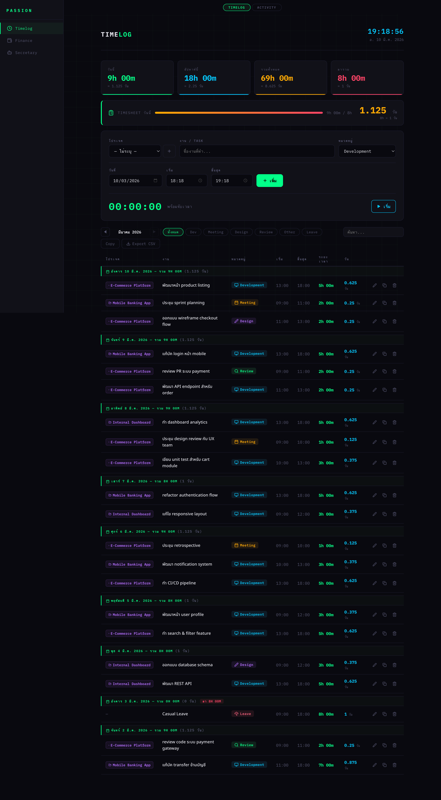
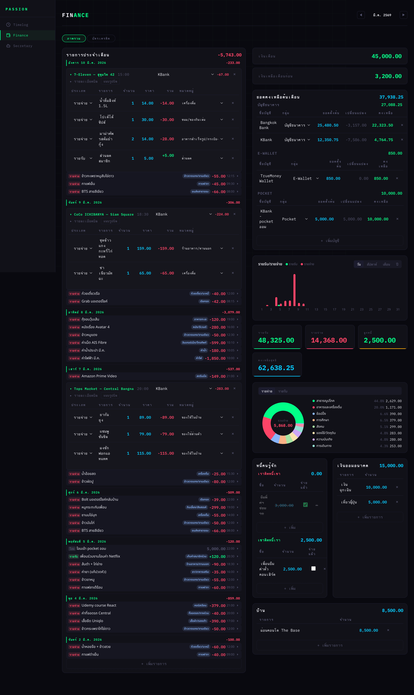
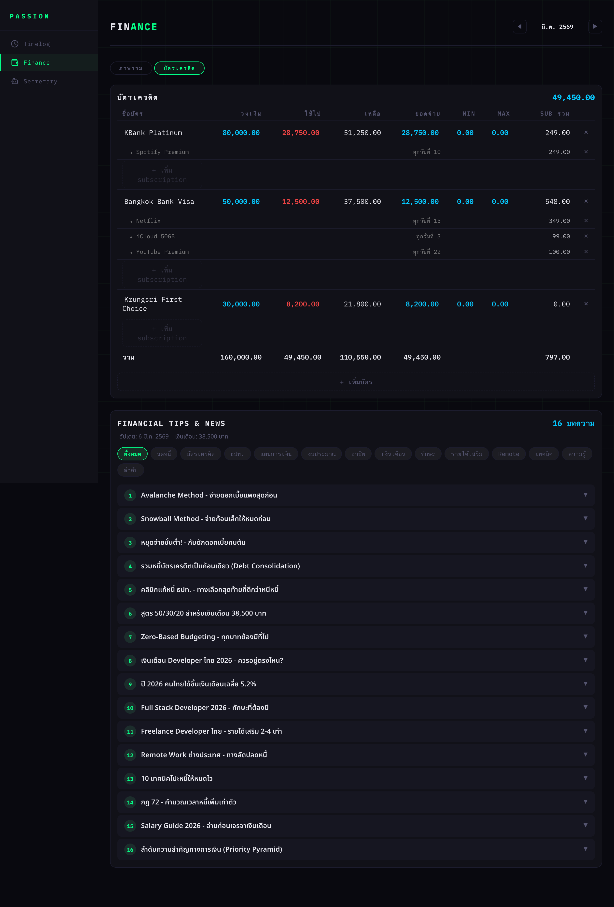

# PASSION

Personal life tracking app — บันทึกเวลาทำงาน, จัดการการเงิน, และบันทึกกิจกรรมประจำวัน

**[Live Demo](https://kijtiaskp.github.io/passion/)**

## Screenshots

### Timelog — บันทึกเวลาทำงาน
สรุปชั่วโมงทำงานรายวัน/สัปดาห์/เดือน พร้อม timesheet bar, ฟอร์มเพิ่ม task, และตารางแสดง log แยกตามวัน



### Finance — ภาพรวมการเงิน
บันทึกรายรับ-รายจ่ายแยกตามวัน, จัดกลุ่มบิลจากร้านค้า, สรุปยอดบัญชี, กราฟรายรับ-รายจ่าย, pie chart สัดส่วนหมวดรายจ่าย, ติดตามหนี้สิน/เงินออม/ผ่อนบ้าน



### Finance — บัตรเครดิต & Financial Tips
จัดการบัตรเครดิตหลายใบ พร้อม subscriptions รายเดือน และบทความ financial tips ที่คัดมาตามสถานะการเงิน



## Features

### Timelog — บันทึกเวลาทำงาน
- บันทึก task รายวัน แยกตาม project และ category (dev, meeting, design, review, leave)
- สรุปชั่วโมงทำงาน วันนี้ / สัปดาห์ / ทั้งเดือน
- รองรับการลา (เต็มวัน / ครึ่งวัน)
- clone log จากวันก่อนหน้าได้

### Finance — จัดการการเงิน
- บันทึกรายรับ-รายจ่าย พร้อม category/subcategory (12 หมวด, ~50 หมวดย่อย)
- จัดการบัตรเครดิต + subscriptions
- scan บิลจากร้านค้า พร้อม itemize รายการอัตโนมัติ
- ติดตามหนี้สิน (ยืม/ให้ยืม), เงินออม, ผ่อนบ้าน
- สรุปภาพรวมการเงิน + กราฟวงกลมแสดงสัดส่วนรายจ่าย
- คำนวณยอดคงเหลือแบบนักบัญชี (แยก savings, credit cards ออกจากสูตร)

### Activity — บันทึกกิจกรรม
- บันทึกกิจกรรมรายวัน (อาหาร, ออกกำลังกาย, พักผ่อน, เดินทาง)
- ติดตาม mood (good, neutral, tired, sleepy, angry)

## Tech Stack

| Layer | Technology |
|-------|-----------|
| Frontend | React 19, TypeScript, Vite |
| Backend | Hono (Node.js) |
| Styling | CSS Variables (dark theme) |
| Routing | react-router-dom (HashRouter) |
| Charts | Recharts |
| Icons | Lucide React |
| Date | date-fns (Thai locale) |

## Project Structure

```
src/
├── app/                  # App entry, router, provider
├── features/
│   ├── timelog/           # Timelog feature
│   │   ├── api/           # API hooks (use-logs, use-activities)
│   │   ├── components/    # UI components
│   │   └── hooks/         # Non-API hooks (use-timer)
│   ├── finance/           # Finance feature
│   │   ├── api/           # API hooks (use-finance)
│   │   └── components/    # UI components
│   └── secretary/         # Secretary feature (WIP)
├── components/            # Shared UI components
├── utils/                 # Shared utilities
└── styles/                # Global styles

server/
├── index.ts               # Hono server entry
├── db.ts                  # JSON file-based storage
└── routes/                # API route handlers

mock/                      # Mock data for demo/deploy
```

## Getting Started

### Prerequisites

- Node.js 20+
- npm

### Development (full stack)

```bash
npm install
npm run dev
```

Frontend จะรันที่ `http://localhost:5173` และ Backend ที่ `http://localhost:3001`

### Demo mode (frontend only)

ถ้าไม่ต้องการรัน backend สามารถรันแค่ frontend ได้:

```bash
npm run dev:client
```

App จะ fallback ใช้ mock data อัตโนมัติเมื่อเชื่อมต่อ API ไม่ได้

## Mock Data

โปรเจคมี mock data สำหรับ demo อยู่ในโฟลเดอร์ `mock/` ซึ่งจะถูกใช้เมื่อ:

- **GitHub Pages** — deployed version ใช้ mock data (ไม่มี backend)
- **Frontend only** — รัน `npm run dev:client` โดยไม่เปิด server
- **Fresh clone** — ยังไม่มี `data/` directory

หากต้องการ copy mock data ไปใช้กับ backend:

```bash
bash mock/setup.sh
```

## API Endpoints

| Method | Endpoint | Description |
|--------|----------|-------------|
| GET | `/api/timelog?month=2026-03` | ดึง log entries ตามเดือน |
| POST | `/api/timelog` | เพิ่ม log entry |
| PUT | `/api/timelog/:id` | แก้ไข log entry |
| DELETE | `/api/timelog/:id` | ลบ log entry |
| GET | `/api/projects` | ดึงรายชื่อ projects |
| POST | `/api/projects` | เพิ่ม project |
| GET | `/api/finance?month=2026-03` | ดึงข้อมูลการเงินตามเดือน |
| POST | `/api/finance/:month/:collection` | เพิ่มรายการ (expenses, bills, etc.) |
| PATCH | `/api/finance/:month/:collection/:id` | แก้ไขรายการ |
| DELETE | `/api/finance/:month/:collection/:id` | ลบรายการ |
| GET | `/api/activity?date=2026-03-10` | ดึงกิจกรรมตามวัน |
| POST | `/api/activity` | เพิ่มกิจกรรม |

## Deployment

Frontend ถูก deploy อัตโนมัติไปยัง GitHub Pages เมื่อ merge เข้า `main` branch ผ่าน GitHub Actions

## License

MIT
